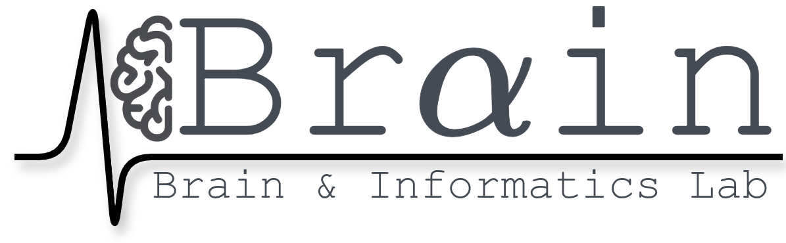

### 

# 

<figure markdown="span">
  { width="60%" }
</figure>

<!-- 
Anupam Sharma
 -->

Welcome to BraIn Lab at IIT Gandhinagar, where diverse and motivated students collaborate on groundbreaking research in computational neuroscience. We explore a wide range of topics, including meditation, music, brain-computer interfaces, emotions, decision-making, brain disorders, movie-watching, and neuro-inspired AI. Our research combines innovative experimental and analytical techniques such as psychophysics, eye tracking, brain imaging (EEG, fMRI), and computational modeling (Reinforcement learning, Bayesian approaches) to deepen our understanding of the brain and its functions.

